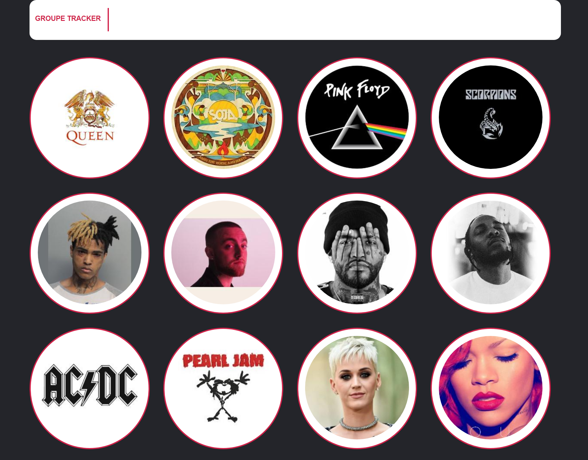
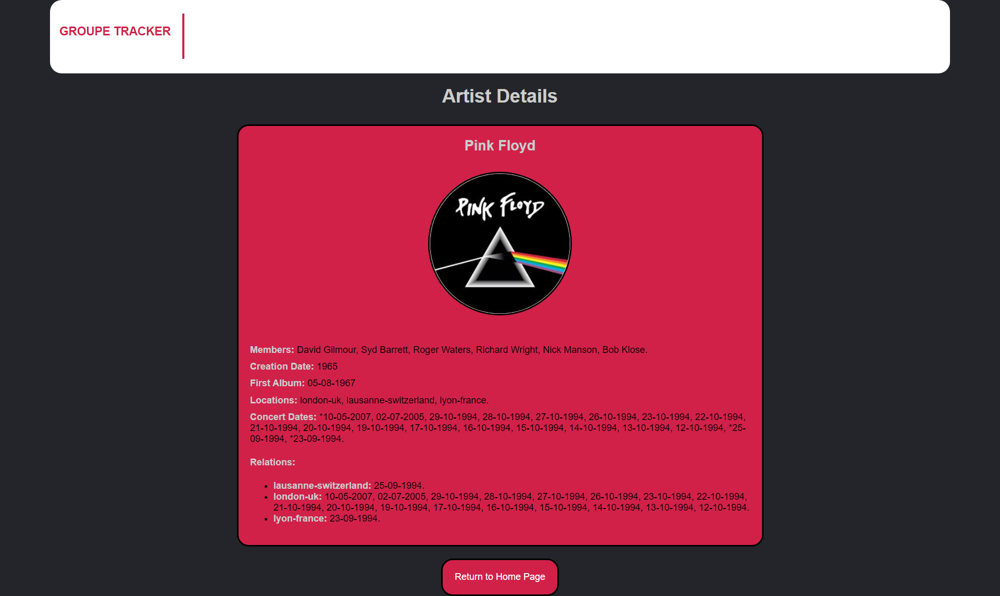

# Music Artist  README

# Index Page


# Artist Details Page



This is a Go program that retrieves data from an API and displays it in a web application. The application fetches data about artists from the "https://groupietrackers.herokuapp.com/api/artists" API endpoint and performs additional API calls to fetch location, date, and relation information for each artist.

## Prerequisites
- Go programming language installed on your machine
- Internet connection to access the API

## Installation

1. Clone the repository:

   ````shell
   git clone https://github.com/your_username/your_project.git
   cd your_project
   ```

2. Install the required dependencies:

   ````shell
   go mod download
   ```

## Usage

1. Run the program:

   ````shell
   go run main.go
   ```

2. Open a web browser and visit "http://localhost:8080" to access the home page.

## Functionality

The program performs the following steps:

1. Retrieves artist data from the API and saves it as a slice of `Artist` structs.

2. For each artist, it fetches location, date, and relation information by making additional API calls.

3. Populates the `Locations`, `ConcertDates`, and `Relations` fields of each `Artist` struct with the fetched data.

4. Starts an HTTP server that listens on port 8080.

5. Handles the following routes:

   - `/`: Displays the home page that lists all the artists and their information.
   - `/artist?id=<artist_id>`: Displays detailed information about a specific artist based on the provided ID.

## File Structure

The project has the following file structure:

- `main.go`: Contains the main program logic.
- `templates/`: Directory containing HTML templates for the web pages.
  - `index.html`: Template for the home page.
  - `artist.html`: Template for the artist details page.
  - `404.html`: Template for the "Page Not Found" error page.
  - `500.html`: Template for the "Internal Server Error" page.

## Contributing

Contributions to this project are welcome. To contribute, follow these steps:

1. Fork the repository.

2. Create a new branch.

3. Make your changes and commit them.

4. Push your changes to your fork.

5. Submit a pull request.

## License

This project is licensed under the [MIT License](https://opensource.org/licenses/MIT).